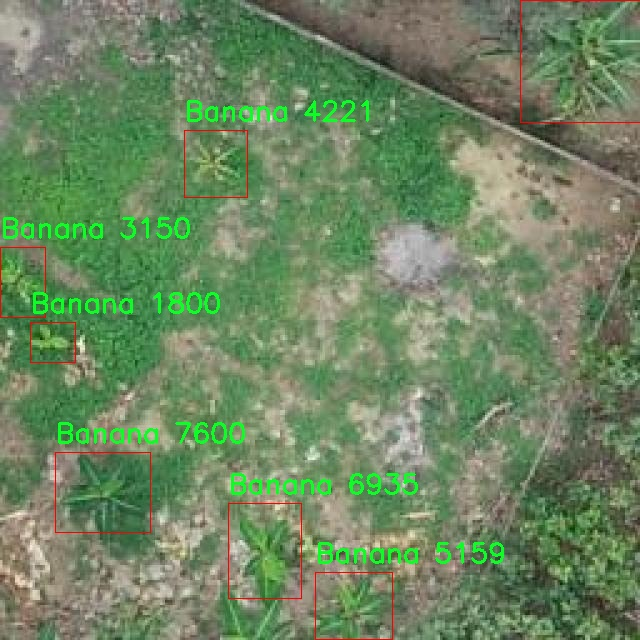

# 水果枝叶藤蔓识别与分类检测系统源码分享
 # [一条龙教学YOLOV8标注好的数据集一键训练_70+全套改进创新点发刊_Web前端展示]

### 1.研究背景与意义

项目参考[AAAI Association for the Advancement of Artificial Intelligence](https://gitee.com/qunmasj/projects)

项目来源[AACV Association for the Advancement of Computer Vision](https://kdocs.cn/l/cszuIiCKVNis)

研究背景与意义

随着全球人口的不断增长和城市化进程的加快，农业生产面临着前所未有的挑战。为了提高农业生产效率和作物产量，现代农业亟需借助先进的技术手段进行智能化管理。计算机视觉技术的迅猛发展为农业领域的智能化提供了新的可能性，尤其是在植物识别与分类方面。近年来，深度学习算法的广泛应用使得图像识别技术在植物分类、病虫害检测等领域取得了显著进展。其中，YOLO（You Only Look Once）系列模型因其高效的实时目标检测能力而受到广泛关注。YOLOv8作为该系列的最新版本，进一步提升了检测精度和速度，为农业应用提供了更为强大的技术支持。

在这一背景下，水果枝叶藤蔓的识别与分类显得尤为重要。水果植物的生长状态、健康状况直接影响到作物的产量和品质，而传统的人工识别方法不仅耗时耗力，而且容易受到主观因素的影响。因此，基于改进YOLOv8的水果枝叶藤蔓识别与分类系统的研究，旨在通过自动化的方式提升识别的准确性和效率，进而为农业生产提供科学依据和决策支持。

本研究将以“Plants-bana”数据集为基础，数据集中包含2800张图像，涵盖香蕉和可可两种植物的分类。这一数据集的构建为模型的训练和验证提供了丰富的样本，确保了研究的科学性和可靠性。通过对该数据集的深入分析与处理，结合YOLOv8的强大特性，我们将能够实现对水果植物枝叶藤蔓的高效识别与分类。这不仅有助于提升农业生产的智能化水平，也为精准农业的发展奠定了基础。

此外，随着全球气候变化和环境问题的日益严重，植物的生长环境和生态系统也面临着严峻挑战。通过对水果植物的精确识别与分类，我们能够更好地监测植物的生长状况，及时发现潜在的病虫害问题，从而采取有效的防治措施，降低农药的使用量，促进可持续农业的发展。这一研究不仅具有重要的学术价值，还有助于推动农业生产的绿色转型，符合当今社会对生态环境保护的迫切需求。

综上所述，基于改进YOLOv8的水果枝叶藤蔓识别与分类系统的研究，不仅为植物识别技术的发展提供了新的思路和方法，也为农业智能化、精准化管理提供了重要的技术支持。通过这一研究，我们期望能够为未来的农业生产模式创新提供有力的理论依据和实践指导，推动农业科技的进步，助力全球粮食安全和可持续发展目标的实现。

### 2.图片演示


##### 注意：由于此博客编辑较早，上面“2.图片演示”和“3.视频演示”展示的系统图片或者视频可能为老版本，新版本在老版本的基础上升级如下：（实际效果以升级的新版本为准）

  （1）适配了YOLOV8的“目标检测”模型和“实例分割”模型，通过加载相应的权重（.pt）文件即可自适应加载模型。

  （2）支持“图片识别”、“视频识别”、“摄像头实时识别”三种识别模式。

  （3）支持“图片识别”、“视频识别”、“摄像头实时识别”三种识别结果保存导出，解决手动导出（容易卡顿出现爆内存）存在的问题，识别完自动保存结果并导出到tempDir中。

  （4）支持Web前端系统中的标题、背景图等自定义修改，后面提供修改教程。

  另外本项目提供训练的数据集和训练教程,暂不提供权重文件（best.pt）,需要您按照教程进行训练后实现图片演示和Web前端界面演示的效果。

### 3.视频演示

[3.1 视频演示](https://www.bilibili.com/video/BV1rvsQeME2P/)

### 4.数据集信息展示

##### 4.1 本项目数据集详细数据（类别数＆类别名）

nc: 2
names: ['Banana', 'Cacao']


##### 4.2 本项目数据集信息介绍

数据集信息展示

在本研究中，我们使用了名为“Plants-bana”的数据集，以支持对水果枝叶藤蔓的识别与分类系统的改进，特别是针对YOLOv8模型的训练与优化。该数据集专注于两种重要的植物类别：香蕉（Banana）和可可（Cacao），这两种植物在农业、食品工业以及生态系统中都占据着重要的地位。通过对这两种植物的深入研究，我们希望能够提高模型在实际应用中的准确性和鲁棒性。

“Plants-bana”数据集的设计考虑到了植物识别与分类的多样性和复杂性。尽管其类别数量仅为两个，但每个类别都包含了丰富的样本数据，涵盖了不同生长阶段、光照条件、气候变化以及背景环境等多种因素。这种多样性使得数据集能够有效地模拟现实世界中植物的生长与变化，从而为YOLOv8模型的训练提供了坚实的基础。

在数据收集过程中，研究团队采用了高质量的图像采集技术，确保每个样本的清晰度和细节表现。图像的拍摄时间、地点以及环境条件都被详细记录，以便后续的分析和模型训练。数据集中包含的图像不仅展示了香蕉和可可植物的整体形态，还细致入微地捕捉了它们的叶片、花朵、果实等特征。这些特征对于模型的训练至关重要，因为它们帮助模型学习到不同植物在不同生长阶段的视觉特征，从而提高识别的准确性。

此外，数据集中的样本经过精心标注，确保每个图像中的植物部分都被准确地框选出来。这种精确的标注不仅提高了训练数据的质量，也为模型提供了清晰的学习目标。通过使用YOLOv8模型，我们能够利用其强大的实时检测能力，快速而准确地识别和分类香蕉与可可植物。这对于农业生产、植物监测以及生态研究等领域都具有重要的应用价值。

在数据集的使用过程中，我们还特别关注了数据的平衡性和多样性。虽然“Plants-bana”数据集的类别数量较少，但我们确保每个类别的样本数量相对均衡，以避免模型在训练过程中出现偏倚现象。此外，我们还引入了数据增强技术，通过旋转、缩放、裁剪等方式生成更多的训练样本，从而进一步提升模型的泛化能力。

总之，“Plants-bana”数据集为我们改进YOLOv8的水果枝叶藤蔓识别与分类系统提供了丰富而高质量的训练数据。通过对香蕉和可可植物的深入研究，我们期望能够推动植物识别技术的发展，为农业和生态研究提供更为精确的工具与方法。随着研究的深入，我们相信该数据集将为相关领域的科学研究和实际应用带来积极的影响。




### 5.全套项目环境部署视频教程（零基础手把手教学）

[5.1 环境部署教程链接（零基础手把手教学）](https://www.ixigua.com/7404473917358506534?logTag=c807d0cbc21c0ef59de5)


[5.2 安装Python虚拟环境创建和依赖库安装视频教程链接（零基础手把手教学）](https://www.ixigua.com/7404474678003106304?logTag=1f1041108cd1f708b01a)

### 6.手把手YOLOV8训练视频教程（零基础小白有手就能学会）

[6.1 手把手YOLOV8训练视频教程（零基础小白有手就能学会）](https://www.ixigua.com/7404477157818401292?logTag=d31a2dfd1983c9668658)

### 7.70+种全套YOLOV8创新点代码加载调参视频教程（一键加载写好的改进模型的配置文件）

[7.1 70+种全套YOLOV8创新点代码加载调参视频教程（一键加载写好的改进模型的配置文件）](https://www.ixigua.com/7404478314661806627?logTag=29066f8288e3f4eea3a4)

### 8.70+种全套YOLOV8创新点原理讲解（非科班也可以轻松写刊发刊，V10版本正在科研待更新）

由于篇幅限制，每个创新点的具体原理讲解就不一一展开，具体见下列网址中的创新点对应子项目的技术原理博客网址【Blog】：


[8.1 70+种全套YOLOV8创新点原理讲解链接](https://gitee.com/qunmasj/good)

### 9.系统功能展示（检测对象为举例，实际内容以本项目数据集为准）

图9.1.系统支持检测结果表格显示

  图9.2.系统支持置信度和IOU阈值手动调节

  图9.3.系统支持自定义加载权重文件best.pt(需要你通过步骤5中训练获得)

  图9.4.系统支持摄像头实时识别

  图9.5.系统支持图片识别

  图9.6.系统支持视频识别

  图9.7.系统支持识别结果文件自动保存

  图9.8.系统支持Excel导出检测结果数据


### 10.原始YOLOV8算法原理

原始YOLOv8算法原理

YOLOv8作为YOLO系列的最新版本，延续了YOLO算法一贯的高效性和实时性，同时在多个方面进行了显著的改进。该算法通过引入新的网络结构和优化技术，进一步提升了目标检测的精度和速度，使其在各种应用场景中表现出色。YOLOv8的设计理念是将目标检测任务视为一个回归问题，利用深度学习技术，通过一个单一的神经网络模型同时预测目标的位置和类别。这种设计不仅简化了传统目标检测方法的复杂性，还提高了模型的计算效率。

YOLOv8的网络结构主要由三个部分组成：Backbone、Neck和Head。Backbone部分负责特征提取，采用了一系列卷积和反卷积层，通过残差连接和瓶颈结构来减小网络的大小并提高性能。具体而言，YOLOv8的Backbone使用了C2模块作为基本构成单元，结合了5个CBS模块、4个C2f模块和1个快速空间金字塔池化（SPPF）模块。这种结构的设计旨在通过多层次的特征提取，捕捉图像中的重要信息，同时保持计算的高效性。

在Neck部分，YOLOv8引入了多尺度特征融合技术。这一技术的核心思想是将来自Backbone不同阶段的特征图进行融合，以便更好地捕捉不同尺度目标的信息。通过这种方式，YOLOv8能够有效地处理各种尺寸的目标，增强了模型的鲁棒性和准确性。Neck部分的设计不仅提升了特征的表达能力，还为后续的目标检测提供了更加丰富的信息基础。

Head部分则是YOLOv8的关键所在，负责最终的目标检测和分类任务。YOLOv8的Head设有三个检测头，分别用于在不同的尺寸信息下检测目标。每个检测头都包含一系列卷积层和反卷积层，旨在生成高质量的检测结果。值得注意的是，YOLOv8采用了解耦头的设计，将分类和回归任务解耦为两个独立的分支。这一创新的设计使得各个任务能够更加专注于自身的目标，从而有效解决了复杂场景下定位不准及分类错误的问题。

此外，YOLOv8还引入了Anchor-free目标检测方法。这种方法不再依赖于预先定义的锚点框，而是通过回归的方式直接预测目标的位置和大小。这一改变使得YOLOv8在处理不同尺度和形状的目标时更加灵活，避免了传统方法中锚点框选择和调整的繁琐过程。通过这种方式，YOLOv8能够更快地聚焦到目标位置的邻近点，使得预测框更接近于实际边界框区域，从而提高了检测的精度。

在训练过程中，YOLOv8采用了新的Pytorch训练和部署框架，使得自定义模型的训练变得更加方便。通过这一框架，用户可以轻松地调整模型参数，进行实验和优化，进而满足特定应用场景的需求。这种灵活性使得YOLOv8不仅适用于学术研究，也适合工业界的实际应用。

YOLOv8的轻量化设计也是其一大亮点。与之前的YOLO系列相比，YOLOv8的模型权重文件进一步减小，这使得其能够被部署到各种嵌入式设备中。无论是在移动设备、无人机还是其他资源受限的环境中，YOLOv8都能提供快速、高效的目标检测能力，满足实时检测的需求。

综上所述，YOLOv8通过一系列创新的设计和优化，不仅继承了YOLO系列的优良传统，还在特征提取、特征融合、目标检测和模型训练等多个方面进行了深度改进。其高效性、灵活性和准确性使得YOLOv8在目标检测领域中占据了重要的位置，成为了研究人员和工程师们的重要工具。随着技术的不断进步，YOLOv8无疑将在未来的目标检测任务中发挥更大的作用。


### 11.项目核心源码讲解（再也不用担心看不懂代码逻辑）

#### 11.1 ui.py

以下是经过简化和注释的核心代码部分：

```python
import sys
import subprocess
from QtFusion.path import abs_path

def run_script(script_path):
    """
    使用当前 Python 环境运行指定的脚本。

    Args:
        script_path (str): 要运行的脚本路径
    """
    # 获取当前 Python 解释器的路径
    python_path = sys.executable

    # 构建运行命令，使用 streamlit 运行指定的脚本
    command = f'"{python_path}" -m streamlit run "{script_path}"'

    # 执行命令并等待其完成
    result = subprocess.run(command, shell=True)
    
    # 检查命令执行结果，如果返回码不为0，表示出错
    if result.returncode != 0:
        print("脚本运行出错。")

# 主程序入口
if __name__ == "__main__":
    # 获取要运行的脚本的绝对路径
    script_path = abs_path("web.py")

    # 调用函数运行脚本
    run_script(script_path)
```

### 代码注释说明：
1. **导入模块**：
   - `sys`：用于获取当前 Python 解释器的路径。
   - `subprocess`：用于执行外部命令。
   - `abs_path`：从 `QtFusion.path` 模块导入，用于获取文件的绝对路径。

2. **`run_script` 函数**：
   - 该函数接收一个脚本路径作为参数，并使用当前 Python 环境运行该脚本。
   - `python_path`：获取当前 Python 解释器的路径。
   - `command`：构建要执行的命令，使用 `streamlit` 运行指定的脚本。
   - `subprocess.run`：执行构建的命令，并等待其完成。
   - 检查命令的返回码，如果不为0，则输出错误信息。

3. **主程序入口**：
   - 通过 `if __name__ == "__main__":` 确保只有在直接运行该脚本时才会执行以下代码。
   - 使用 `abs_path` 获取要运行的脚本 `web.py` 的绝对路径。
   - 调用 `run_script` 函数运行指定的脚本。

这个程序文件名为 `ui.py`，其主要功能是运行一个指定的 Python 脚本，具体是使用 Streamlit 框架来启动一个 Web 应用。代码中首先导入了必要的模块，包括 `sys`、`os` 和 `subprocess`，以及一个自定义的 `abs_path` 函数，用于获取文件的绝对路径。

在 `run_script` 函数中，首先获取当前 Python 解释器的路径，这通过 `sys.executable` 实现。接着，构建一个命令字符串，这个命令用于调用 Streamlit 来运行指定的脚本。命令的格式是 `"{python_path}" -m streamlit run "{script_path}"`，其中 `script_path` 是要运行的脚本的路径。

然后，使用 `subprocess.run` 方法来执行这个命令。这个方法会在一个新的进程中运行命令，并等待其完成。如果命令执行的返回码不为零，表示脚本运行出错，程序会打印出错误信息。

在文件的最后部分，使用 `if __name__ == "__main__":` 语句来确保当这个文件作为主程序运行时，才会执行后面的代码。在这里，指定了要运行的脚本路径 `web.py`，并调用 `run_script` 函数来启动这个脚本。

总体来说，这个文件的功能是通过 Streamlit 框架来启动一个 Web 应用，且具备基本的错误处理机制。

#### 11.2 code\ultralytics\models\sam\modules\tiny_encoder.py

以下是提取出的核心代码部分，并附上详细的中文注释：

```python
import torch
import torch.nn as nn
import torch.nn.functional as F

class Conv2d_BN(torch.nn.Sequential):
    """一个顺序容器，执行2D卷积，后接批量归一化。"""

    def __init__(self, in_channels, out_channels, kernel_size=1, stride=1, padding=0, dilation=1, groups=1, bn_weight_init=1):
        """初始化卷积层和批量归一化层。"""
        super().__init__()
        # 添加卷积层
        self.add_module("conv", torch.nn.Conv2d(in_channels, out_channels, kernel_size, stride, padding, dilation, groups, bias=False))
        # 添加批量归一化层
        bn = torch.nn.BatchNorm2d(out_channels)
        # 初始化批量归一化的权重和偏置
        torch.nn.init.constant_(bn.weight, bn_weight_init)
        torch.nn.init.constant_(bn.bias, 0)
        self.add_module("bn", bn)

class PatchEmbed(nn.Module):
    """将图像嵌入为补丁，并将其投影到指定的嵌入维度。"""

    def __init__(self, in_chans, embed_dim, resolution, activation):
        """初始化PatchEmbed类。"""
        super().__init__()
        img_size = (resolution, resolution)  # 假设输入图像为正方形
        self.patches_resolution = (img_size[0] // 4, img_size[1] // 4)  # 计算补丁的分辨率
        self.in_chans = in_chans
        self.embed_dim = embed_dim
        n = embed_dim
        # 定义嵌入序列
        self.seq = nn.Sequential(
            Conv2d_BN(in_chans, n // 2, 3, 2, 1),  # 第一个卷积层
            activation(),  # 激活函数
            Conv2d_BN(n // 2, n, 3, 2, 1),  # 第二个卷积层
        )

    def forward(self, x):
        """将输入张量x通过PatchEmbed模型的序列操作。"""
        return self.seq(x)

class TinyViT(nn.Module):
    """TinyViT架构，用于视觉任务。"""

    def __init__(self, img_size=224, in_chans=3, num_classes=1000, embed_dims=[96, 192, 384, 768], depths=[2, 2, 6, 2], num_heads=[3, 6, 12, 24], window_sizes=[7, 7, 14, 7], mlp_ratio=4.0, drop_rate=0.0, drop_path_rate=0.1, use_checkpoint=False):
        """初始化TinyViT模型。"""
        super().__init__()
        self.img_size = img_size
        self.num_classes = num_classes
        self.depths = depths
        self.num_layers = len(depths)
        self.mlp_ratio = mlp_ratio

        activation = nn.GELU  # 使用GELU激活函数

        # 初始化补丁嵌入层
        self.patch_embed = PatchEmbed(in_chans=in_chans, embed_dim=embed_dims[0], resolution=img_size, activation=activation)

        # 构建层
        self.layers = nn.ModuleList()
        for i_layer in range(self.num_layers):
            layer = BasicLayer(
                dim=embed_dims[i_layer],
                input_resolution=(self.img_size // (2 ** i_layer), self.img_size // (2 ** i_layer)),
                depth=depths[i_layer],
                num_heads=num_heads[i_layer],
                window_size=window_sizes[i_layer],
                mlp_ratio=self.mlp_ratio,
                drop=drop_rate,
                use_checkpoint=use_checkpoint,
            )
            self.layers.append(layer)

        # 分类头
        self.head = nn.Linear(embed_dims[-1], num_classes) if num_classes > 0 else nn.Identity()

    def forward(self, x):
        """执行输入张量的前向传播。"""
        x = self.patch_embed(x)  # 通过补丁嵌入层
        for layer in self.layers:
            x = layer(x)  # 通过每一层
        return self.head(x)  # 通过分类头
```

### 代码说明：
1. **Conv2d_BN**：定义了一个包含卷积层和批量归一化层的顺序容器，简化了卷积操作的定义。
2. **PatchEmbed**：将输入图像嵌入为多个补丁，并通过卷积层将其投影到指定的嵌入维度。
3. **TinyViT**：主模型类，负责构建TinyViT架构。包括补丁嵌入层和多个基本层（BasicLayer），并在最后通过线性层进行分类。

以上是核心部分的提取和注释，保留了模型的基本结构和功能。

这个程序文件实现了一个名为TinyViT的视觉模型架构，主要用于图像处理任务。TinyViT是基于ViT（Vision Transformer）和EfficientNet的思想，结合了自注意力机制和卷积操作，以提高模型的性能和效率。

文件中首先导入了一些必要的库，包括PyTorch的核心模块和一些实用工具。接着定义了一些基础组件，如Conv2d_BN、PatchEmbed、MBConv等。这些组件构成了TinyViT模型的基本单元。

Conv2d_BN类是一个顺序容器，执行二维卷积操作并随后进行批归一化。PatchEmbed类将输入图像分割成小块，并将这些小块映射到指定的嵌入维度。MBConv类实现了移动反向瓶颈卷积层，这是EfficientNet架构中的重要组成部分，具有扩展比、激活函数和drop path等参数。

PatchMerging类负责将相邻的小块合并，并将其投影到新的维度。ConvLayer类则由多个MBConv层组成，并可选择性地对输出进行下采样。Mlp类实现了多层感知机，通常用于Transformer架构中的前馈网络。Attention类实现了多头自注意力机制，支持空间感知，通过对空间位置的偏置进行训练来增强模型的表现。

TinyViTBlock类结合了自注意力和局部卷积，形成TinyViT的基本块。BasicLayer类是TinyViT架构中的一个基本层，包含多个TinyViTBlock，并可以选择性地进行下采样。LayerNorm2d类实现了二维的层归一化。

TinyViT类是整个模型的核心，初始化时接收输入图像的大小、输入通道数、分类类别数、嵌入维度、层深度、注意力头数、窗口大小等参数。它构建了模型的各个层，并实现了前向传播的方法。模型的最后一层是一个分类头，用于输出最终的分类结果。

在前向传播过程中，输入图像首先通过PatchEmbed进行处理，然后依次通过各个层进行特征提取，最后通过分类头输出结果。模型还支持梯度检查点，以节省内存。

整体来看，这个程序文件展示了如何构建一个高效的视觉模型，结合了现代深度学习中的多种技术和方法，适用于图像分类等任务。

#### 11.3 code\ultralytics\utils\torch_utils.py

以下是经过简化和注释的核心代码部分，主要集中在模型选择、设备管理、模型信息获取等功能上：

```python
import os
import platform
import torch
import torch.nn as nn
import torchvision
from ultralytics.utils import LOGGER, __version__

def select_device(device="", batch=0, verbose=True):
    """
    选择合适的 PyTorch 设备（CPU 或 GPU）。

    参数:
        device (str | torch.device, optional): 设备字符串或 torch.device 对象。
        batch (int, optional): 模型使用的批量大小。默认为 0。
        verbose (bool, optional): 如果为 True，则记录设备信息。默认为 True。

    返回:
        (torch.device): 选择的设备。

    异常:
        ValueError: 如果指定的设备不可用或批量大小不是设备数量的倍数。
    """
    if isinstance(device, torch.device):
        return device

    device = str(device).lower().strip()  # 转为小写并去除空格
    if device in ["cpu", "none"]:
        os.environ["CUDA_VISIBLE_DEVICES"] = "-1"  # 强制使用 CPU
        arg = "cpu"
    else:
        os.environ["CUDA_VISIBLE_DEVICES"] = device  # 设置可见设备
        if not torch.cuda.is_available():
            raise ValueError(f"无效的 CUDA 设备 '{device}' 请求。")
        arg = "cuda:0"  # 默认选择第一个 GPU

    if verbose:
        LOGGER.info(f"使用设备: {arg}")
    return torch.device(arg)

def model_info(model, detailed=False, verbose=True):
    """
    获取模型信息，包括参数数量和层数。

    参数:
        model: PyTorch 模型。
        detailed (bool, optional): 是否显示详细信息。默认为 False。
        verbose (bool, optional): 如果为 True，则记录模型信息。默认为 True。

    返回:
        (int, int, int): 层数、参数数量、梯度数量。
    """
    if not verbose:
        return
    n_p = sum(p.numel() for p in model.parameters())  # 计算参数数量
    n_g = sum(p.numel() for p in model.parameters() if p.requires_grad)  # 计算需要梯度的参数数量
    n_l = len(list(model.modules()))  # 计算层数

    if detailed:
        LOGGER.info(f"模型层数: {n_l}, 参数数量: {n_p}, 梯度数量: {n_g}")

    return n_l, n_p, n_g

def time_sync():
    """同步时间，确保在多 GPU 环境下的时间准确性。"""
    if torch.cuda.is_available():
        torch.cuda.synchronize()  # 确保所有 GPU 完成计算
    return time.time()  # 返回当前时间

# 示例用法
if __name__ == "__main__":
    device = select_device("cuda:0")  # 选择第一个 GPU
    model = torchvision.models.resnet50(pretrained=True)  # 加载预训练的 ResNet50 模型
    model_info(model, detailed=True)  # 获取模型信息
```

### 代码注释说明：
1. **select_device**: 该函数用于选择合适的计算设备（CPU 或 GPU），并根据用户输入设置环境变量。它还会检查设备的可用性，并在选择 GPU 时确保批量大小与设备数量匹配。
  
2. **model_info**: 该函数用于获取模型的基本信息，包括参数数量、梯度数量和层数。可以选择是否输出详细信息。

3. **time_sync**: 该函数用于在多 GPU 环境下同步时间，以确保时间测量的准确性。

### 其他说明：
- 代码中使用了 `LOGGER` 记录信息，方便调试和跟踪。
- 示例用法展示了如何选择设备和获取模型信息。

这个程序文件是一个与Ultralytics YOLO（You Only Look Once）模型相关的工具库，主要用于PyTorch框架中的各种实用功能。代码包含了多个函数和类，旨在简化模型的训练、推理和评估过程。

首先，文件导入了一些必要的库，包括数学运算、操作系统、随机数生成、时间管理等。此外，还引入了PyTorch和Torchvision库，以便进行深度学习相关的操作。代码中还检查了当前使用的PyTorch和Torchvision的版本，以确保与特定功能的兼容性。

接下来，定义了一个上下文管理器`torch_distributed_zero_first`，用于在分布式训练中确保所有进程在本地主节点完成某些操作之前等待。这对于多GPU训练非常重要。

`smart_inference_mode`函数根据PyTorch的版本选择合适的推理模式，确保在推理时不会计算梯度，从而提高性能。

`select_device`函数用于选择合适的计算设备（CPU或GPU），并根据输入参数验证设备的可用性。如果请求的设备不可用，函数会抛出异常。

`time_sync`函数用于同步CUDA时间，确保在多GPU环境中准确测量时间。

`fuse_conv_and_bn`和`fuse_deconv_and_bn`函数用于将卷积层和批归一化层融合，以提高模型的推理速度和效率。这种融合操作可以减少计算量并加快推理速度。

`model_info`函数提供了模型的详细信息，包括参数数量、梯度数量和层数等。可以选择是否输出详细信息。

`get_flops`函数计算模型的浮点运算次数（FLOPs），这对于评估模型的计算复杂度非常有用。

`initialize_weights`函数用于初始化模型的权重，确保模型在训练开始时具有合理的初始值。

`scale_img`函数用于根据给定的比例缩放和填充图像，以适应模型的输入要求。

`copy_attr`函数用于从一个对象复制属性到另一个对象，可以选择性地包含或排除某些属性。

`strip_optimizer`函数用于从训练好的模型中去除优化器信息，以便在保存模型时减小文件大小。

`profile`函数用于分析模型的速度、内存和FLOPs，帮助开发者了解模型的性能。

`EarlyStopping`类用于实现早停机制，当训练过程中若干个epoch没有性能提升时，会提前停止训练，以防止过拟合。

总的来说，这个文件提供了一系列实用的工具和功能，旨在帮助开发者更高效地使用YOLO模型进行训练和推理。通过这些工具，用户可以更方便地管理设备选择、模型信息、性能分析和训练过程中的各种操作。

#### 11.4 70+种YOLOv8算法改进源码大全和调试加载训练教程（非必要）\ultralytics\trackers\utils\gmc.py

以下是代码中最核心的部分，并附上详细的中文注释：

```python
import cv2
import numpy as np

class GMC:
    """
    一般化运动补偿（GMC）类，用于视频帧中的跟踪和物体检测。
    """

    def __init__(self, method='sparseOptFlow', downscale=2):
        """初始化GMC对象，设置跟踪方法和缩放因子。"""
        self.method = method  # 设置跟踪方法
        self.downscale = max(1, int(downscale))  # 设置缩放因子，确保至少为1

        # 根据选择的方法初始化特征检测器和匹配器
        if self.method == 'orb':
            self.detector = cv2.FastFeatureDetector_create(20)
            self.extractor = cv2.ORB_create()
            self.matcher = cv2.BFMatcher(cv2.NORM_HAMMING)
        elif self.method == 'sift':
            self.detector = cv2.SIFT_create(nOctaveLayers=3, contrastThreshold=0.02, edgeThreshold=20)
            self.extractor = cv2.SIFT_create(nOctaveLayers=3, contrastThreshold=0.02, edgeThreshold=20)
            self.matcher = cv2.BFMatcher(cv2.NORM_L2)
        elif self.method == 'ecc':
            self.warp_mode = cv2.MOTION_EUCLIDEAN  # 设置运动模型为欧几里得
            self.criteria = (cv2.TERM_CRITERIA_EPS | cv2.TERM_CRITERIA_COUNT, 5000, 1e-6)  # 迭代终止条件
        elif self.method == 'sparseOptFlow':
            self.feature_params = dict(maxCorners=1000, qualityLevel=0.01, minDistance=1, blockSize=3)
        elif self.method in ['none', 'None', None]:
            self.method = None
        else:
            raise ValueError(f'错误: 未知的GMC方法: {method}')

        # 初始化前一帧和关键点
        self.prevFrame = None
        self.prevKeyPoints = None
        self.prevDescriptors = None
        self.initializedFirstFrame = False  # 标记是否已处理第一帧

    def apply(self, raw_frame, detections=None):
        """根据指定的方法在原始帧上应用物体检测。"""
        if self.method in ['orb', 'sift']:
            return self.applyFeatures(raw_frame, detections)  # 使用特征方法
        elif self.method == 'ecc':
            return self.applyEcc(raw_frame, detections)  # 使用ECC方法
        elif self.method == 'sparseOptFlow':
            return self.applySparseOptFlow(raw_frame, detections)  # 使用稀疏光流方法
        else:
            return np.eye(2, 3)  # 返回单位矩阵

    def applyEcc(self, raw_frame, detections=None):
        """应用ECC算法进行运动补偿。"""
        height, width, _ = raw_frame.shape  # 获取帧的高度和宽度
        frame = cv2.cvtColor(raw_frame, cv2.COLOR_BGR2GRAY)  # 转换为灰度图
        H = np.eye(2, 3, dtype=np.float32)  # 初始化变换矩阵

        # 根据缩放因子调整图像大小
        if self.downscale > 1.0:
            frame = cv2.resize(frame, (width // self.downscale, height // self.downscale))

        # 处理第一帧
        if not self.initializedFirstFrame:
            self.prevFrame = frame.copy()  # 保存当前帧
            self.initializedFirstFrame = True  # 标记为已初始化
            return H

        # 运行ECC算法，计算变换矩阵H
        try:
            (cc, H) = cv2.findTransformECC(self.prevFrame, frame, H, self.warp_mode, self.criteria, None, 1)
        except Exception as e:
            LOGGER.warning(f'警告: 找到变换失败，设置H为单位矩阵 {e}')

        return H

    def applyFeatures(self, raw_frame, detections=None):
        """应用特征检测和匹配。"""
        height, width, _ = raw_frame.shape
        frame = cv2.cvtColor(raw_frame, cv2.COLOR_BGR2GRAY)
        H = np.eye(2, 3)

        # 根据缩放因子调整图像大小
        if self.downscale > 1.0:
            frame = cv2.resize(frame, (width // self.downscale, height // self.downscale))

        # 检测关键点
        keypoints = self.detector.detect(frame)

        # 处理第一帧
        if not self.initializedFirstFrame:
            self.prevFrame = frame.copy()
            self.prevKeyPoints = copy.copy(keypoints)
            self.initializedFirstFrame = True
            return H

        # 匹配描述符
        knnMatches = self.matcher.knnMatch(self.prevDescriptors, descriptors, 2)

        # 过滤匹配
        matches = []
        for m, n in knnMatches:
            if m.distance < 0.9 * n.distance:
                matches.append(m)

        # 找到刚性变换矩阵
        if len(matches) > 4:
            prevPoints = np.array([self.prevKeyPoints[m.queryIdx].pt for m in matches])
            currPoints = np.array([keypoints[m.trainIdx].pt for m in matches])
            H, inliers = cv2.estimateAffinePartial2D(prevPoints, currPoints, cv2.RANSAC)

        # 保存当前帧和关键点
        self.prevFrame = frame.copy()
        self.prevKeyPoints = copy.copy(keypoints)

        return H

    def applySparseOptFlow(self, raw_frame, detections=None):
        """应用稀疏光流算法进行运动补偿。"""
        height, width, _ = raw_frame.shape
        frame = cv2.cvtColor(raw_frame, cv2.COLOR_BGR2GRAY)
        H = np.eye(2, 3)

        # 根据缩放因子调整图像大小
        if self.downscale > 1.0:
            frame = cv2.resize(frame, (width // self.downscale, height // self.downscale))

        # 检测关键点
        keypoints = cv2.goodFeaturesToTrack(frame, mask=None, **self.feature_params)

        # 处理第一帧
        if not self.initializedFirstFrame:
            self.prevFrame = frame.copy()
            self.prevKeyPoints = copy.copy(keypoints)
            self.initializedFirstFrame = True
            return H

        # 计算光流
        matchedKeypoints, status, err = cv2.calcOpticalFlowPyrLK(self.prevFrame, frame, self.prevKeyPoints, None)

        # 过滤有效的匹配点
        prevPoints = []
        currPoints = []
        for i in range(len(status)):
            if status[i]:
                prevPoints.append(self.prevKeyPoints[i])
                currPoints.append(matchedKeypoints[i])

        # 找到刚性变换矩阵
        if len(prevPoints) > 4:
            H, inliers = cv2.estimateAffinePartial2D(np.array(prevPoints), np.array(currPoints), cv2.RANSAC)

        # 保存当前帧和关键点
        self.prevFrame = frame.copy()
        self.prevKeyPoints = copy.copy(keypoints)

        return H
```

### 代码说明
1. **类初始化**：`__init__`方法中根据指定的跟踪方法初始化相应的特征检测器和匹配器，同时设置缩放因子和其他必要的变量。
2. **应用方法**：`apply`方法根据选择的跟踪方法调用相应的处理函数（如`applyFeatures`、`applyEcc`等）。
3. **ECC算法**：`applyEcc`方法实现了基于ECC的运动补偿，通过计算当前帧与前一帧之间的变换矩阵来进行补偿。
4. **特征检测与匹配**：`applyFeatures`方法实现了特征点的检测和匹配，使用ORB或SIFT算法来提取特征并进行匹配。
5. **稀疏光流**：`applySparseOptFlow`方法实现了稀疏光流算法，通过计算光流来估计运动。

以上代码是实现视频帧跟踪和物体检测的核心部分，能够根据不同的算法进行运动补偿和特征匹配。

这个程序文件定义了一个名为 `GMC` 的类，主要用于视频帧中的跟踪和物体检测。该类实现了多种跟踪算法，包括 ORB、SIFT、ECC 和稀疏光流，支持对帧进行下采样以提高计算效率。

在类的初始化方法 `__init__` 中，用户可以指定跟踪方法和下采样因子。根据选择的跟踪方法，程序会初始化相应的特征检测器、描述符提取器和匹配器。例如，对于 ORB 方法，使用 `cv2.ORB_create()` 创建特征提取器；对于 SIFT 方法，使用 `cv2.SIFT_create()`。如果选择了 ECC 方法，则会设置相关的迭代次数和终止条件；而稀疏光流方法则使用 `cv2.goodFeaturesToTrack()` 来检测特征点。

类中有一个 `apply` 方法，根据当前选择的跟踪方法对输入的原始帧进行处理。这个方法会调用相应的处理函数，如 `applyEcc`、`applyFeatures` 或 `applySparseOptFlow`，来执行具体的跟踪算法。

`applyEcc` 方法实现了 ECC 算法，首先将输入帧转换为灰度图像，并进行下采样处理。对于第一帧，程序会初始化相关数据并返回单位矩阵。之后，使用 `cv2.findTransformECC()` 方法计算当前帧与前一帧之间的变换矩阵。

`applyFeatures` 方法则使用特征点匹配的方法进行跟踪。它同样将帧转换为灰度图像并进行下采样，接着检测特征点并计算描述符。对于第一帧，初始化数据后返回单位矩阵。之后，程序会通过 KNN 匹配器找到描述符之间的匹配，并根据空间距离过滤匹配结果，最终使用 `cv2.estimateAffinePartial2D()` 方法估计刚性变换矩阵。

`applySparseOptFlow` 方法实现了稀疏光流算法，首先将帧转换为灰度图像并进行下采样。然后，使用 `cv2.goodFeaturesToTrack()` 检测特征点，并在第一帧时进行初始化。接下来，使用 `cv2.calcOpticalFlowPyrLK()` 方法计算特征点的光流，最后估计变换矩阵。

整个类的设计旨在提供一个灵活的框架，以便在视频处理任务中选择不同的跟踪算法，并根据需要进行调整。通过使用 OpenCV 库的功能，GMC 类能够高效地处理视频帧并进行物体跟踪。

#### 11.5 train.py

以下是代码中最核心的部分，并附上详细的中文注释：

```python
class DetectionTrainer(BaseTrainer):
    """
    DetectionTrainer类，继承自BaseTrainer类，用于基于检测模型的训练。
    """

    def build_dataset(self, img_path, mode="train", batch=None):
        """
        构建YOLO数据集。

        参数:
            img_path (str): 包含图像的文件夹路径。
            mode (str): 模式，可以是'train'或'val'，用户可以为每种模式自定义不同的增强。
            batch (int, optional): 批次大小，仅用于'rect'模式。默认为None。
        """
        gs = max(int(de_parallel(self.model).stride.max() if self.model else 0), 32)
        return build_yolo_dataset(self.args, img_path, batch, self.data, mode=mode, rect=mode == "val", stride=gs)

    def get_dataloader(self, dataset_path, batch_size=16, rank=0, mode="train"):
        """构造并返回数据加载器。"""
        assert mode in ["train", "val"]  # 确保模式是'train'或'val'
        with torch_distributed_zero_first(rank):  # 在分布式训练中，确保数据集只初始化一次
            dataset = self.build_dataset(dataset_path, mode, batch_size)  # 构建数据集
        shuffle = mode == "train"  # 训练模式下打乱数据
        if getattr(dataset, "rect", False) and shuffle:
            LOGGER.warning("WARNING ⚠️ 'rect=True'与DataLoader的shuffle不兼容，设置shuffle=False")
            shuffle = False
        workers = self.args.workers if mode == "train" else self.args.workers * 2  # 设置工作线程数
        return build_dataloader(dataset, batch_size, workers, shuffle, rank)  # 返回数据加载器

    def preprocess_batch(self, batch):
        """对一批图像进行预处理，包括缩放和转换为浮点数。"""
        batch["img"] = batch["img"].to(self.device, non_blocking=True).float() / 255  # 将图像转移到设备并归一化
        if self.args.multi_scale:  # 如果启用多尺度
            imgs = batch["img"]
            sz = (
                random.randrange(self.args.imgsz * 0.5, self.args.imgsz * 1.5 + self.stride)
                // self.stride
                * self.stride
            )  # 随机选择一个新的尺寸
            sf = sz / max(imgs.shape[2:])  # 计算缩放因子
            if sf != 1:  # 如果缩放因子不为1
                ns = [
                    math.ceil(x * sf / self.stride) * self.stride for x in imgs.shape[2:]
                ]  # 计算新的形状
                imgs = nn.functional.interpolate(imgs, size=ns, mode="bilinear", align_corners=False)  # 进行插值
            batch["img"] = imgs  # 更新批次图像
        return batch

    def get_model(self, cfg=None, weights=None, verbose=True):
        """返回YOLO检测模型。"""
        model = DetectionModel(cfg, nc=self.data["nc"], verbose=verbose and RANK == -1)  # 创建检测模型
        if weights:
            model.load(weights)  # 加载权重
        return model

    def get_validator(self):
        """返回用于YOLO模型验证的DetectionValidator。"""
        self.loss_names = "box_loss", "cls_loss", "dfl_loss"  # 定义损失名称
        return yolo.detect.DetectionValidator(
            self.test_loader, save_dir=self.save_dir, args=copy(self.args), _callbacks=self.callbacks
        )  # 返回验证器

    def plot_training_samples(self, batch, ni):
        """绘制带有注释的训练样本。"""
        plot_images(
            images=batch["img"],
            batch_idx=batch["batch_idx"],
            cls=batch["cls"].squeeze(-1),
            bboxes=batch["bboxes"],
            paths=batch["im_file"],
            fname=self.save_dir / f"train_batch{ni}.jpg",
            on_plot=self.on_plot,
        )  # 绘制图像

    def plot_metrics(self):
        """从CSV文件中绘制指标。"""
        plot_results(file=self.csv, on_plot=self.on_plot)  # 保存结果图
```

### 代码核心部分解释：
1. **DetectionTrainer类**：这是一个用于训练YOLO检测模型的类，继承自BaseTrainer。
2. **build_dataset方法**：用于构建YOLO数据集，支持训练和验证模式。
3. **get_dataloader方法**：构造数据加载器，负责加载数据集并设置相关参数。
4. **preprocess_batch方法**：对输入的图像批次进行预处理，包括归一化和缩放。
5. **get_model方法**：创建并返回YOLO检测模型，可以选择加载预训练权重。
6. **get_validator方法**：返回用于模型验证的验证器，记录损失名称。
7. **plot_training_samples和plot_metrics方法**：用于可视化训练样本和训练过程中的指标。

这个程序文件 `train.py` 是一个用于训练 YOLO（You Only Look Once）目标检测模型的脚本，继承自 `BaseTrainer` 类。它主要负责构建数据集、创建数据加载器、预处理图像批次、设置模型属性、获取模型、进行验证、记录损失、输出训练进度、绘制训练样本和指标等功能。

在 `DetectionTrainer` 类中，首先定义了 `build_dataset` 方法，用于构建 YOLO 数据集。这个方法接收图像路径、模式（训练或验证）和批次大小作为参数，利用 `build_yolo_dataset` 函数生成数据集。

接着，`get_dataloader` 方法用于构建和返回数据加载器。它会根据模式选择是否打乱数据，并设置工作线程的数量。这个方法还包含了一个分布式训练的处理，确保数据集只初始化一次。

`preprocess_batch` 方法负责对图像批次进行预处理，包括将图像缩放到合适的大小并转换为浮点数。它还支持多尺度训练，随机选择图像的大小进行训练。

`set_model_attributes` 方法用于设置模型的属性，包括类别数量和类别名称。这些属性会影响模型的训练和预测。

`get_model` 方法返回一个 YOLO 检测模型，并可以加载预训练权重。`get_validator` 方法则返回一个用于模型验证的对象，记录损失名称。

`label_loss_items` 方法返回一个包含标记训练损失项的字典，方便后续记录和分析。`progress_string` 方法生成一个格式化的字符串，用于输出训练进度，包括当前的 epoch、GPU 内存使用情况、损失值、实例数量和图像大小。

此外，`plot_training_samples` 方法用于绘制训练样本及其标注，`plot_metrics` 方法用于从 CSV 文件中绘制训练指标，`plot_training_labels` 方法则创建一个带标签的训练图，展示训练数据中的边界框和类别。

整体来看，这个文件提供了一个完整的训练框架，涵盖了从数据准备到模型训练和评估的各个环节，适用于使用 YOLO 模型进行目标检测任务。

#### 11.6 code\ultralytics\models\yolo\segment\train.py

以下是经过简化和注释的核心代码部分：

```python
# 导入必要的库和模块
from copy import copy
from ultralytics.models import yolo
from ultralytics.nn.tasks import SegmentationModel
from ultralytics.utils import DEFAULT_CFG, RANK
from ultralytics.utils.plotting import plot_images, plot_results

class SegmentationTrainer(yolo.detect.DetectionTrainer):
    """
    扩展DetectionTrainer类以支持基于分割模型的训练。
    示例用法：
        ```python
        from ultralytics.models.yolo.segment import SegmentationTrainer

        args = dict(model='yolov8n-seg.pt', data='coco8-seg.yaml', epochs=3)
        trainer = SegmentationTrainer(overrides=args)
        trainer.train()
        ```
    """

    def __init__(self, cfg=DEFAULT_CFG, overrides=None, _callbacks=None):
        """初始化SegmentationTrainer对象，使用给定的参数。"""
        if overrides is None:
            overrides = {}
        overrides["task"] = "segment"  # 设置任务类型为分割
        super().__init__(cfg, overrides, _callbacks)  # 调用父类构造函数

    def get_model(self, cfg=None, weights=None, verbose=True):
        """返回使用指定配置和权重初始化的SegmentationModel。"""
        # 创建分割模型实例
        model = SegmentationModel(cfg, ch=3, nc=self.data["nc"], verbose=verbose and RANK == -1)
        if weights:
            model.load(weights)  # 如果提供了权重，则加载权重

        return model  # 返回模型实例

    def get_validator(self):
        """返回SegmentationValidator实例，用于YOLO模型的验证。"""
        self.loss_names = "box_loss", "seg_loss", "cls_loss", "dfl_loss"  # 定义损失名称
        return yolo.segment.SegmentationValidator(
            self.test_loader, save_dir=self.save_dir, args=copy(self.args), _callbacks=self.callbacks
        )  # 返回验证器实例

    def plot_training_samples(self, batch, ni):
        """创建带有标签和框坐标的训练样本图像的绘图。"""
        plot_images(
            batch["img"],  # 训练图像
            batch["batch_idx"],  # 批次索引
            batch["cls"].squeeze(-1),  # 类别标签
            batch["bboxes"],  # 边界框
            masks=batch["masks"],  # 分割掩码
            paths=batch["im_file"],  # 图像文件路径
            fname=self.save_dir / f"train_batch{ni}.jpg",  # 保存图像的文件名
            on_plot=self.on_plot,  # 绘图回调
        )

    def plot_metrics(self):
        """绘制训练和验证指标。"""
        plot_results(file=self.csv, segment=True, on_plot=self.on_plot)  # 保存结果图像
```

### 代码说明：
1. **导入模块**：导入了必要的库和模块，包括模型、任务、默认配置和绘图工具。
2. **SegmentationTrainer类**：该类继承自`DetectionTrainer`，用于处理分割任务的训练。
3. **构造函数**：初始化方法设置任务类型为分割，并调用父类的构造函数。
4. **get_model方法**：创建并返回一个分割模型实例，支持加载预训练权重。
5. **get_validator方法**：返回一个用于验证模型的实例，并定义损失名称。
6. **plot_training_samples方法**：绘制训练样本图像，包括图像、类别、边界框和分割掩码。
7. **plot_metrics方法**：绘制训练和验证的指标，并保存结果图像。

这个程序文件是用于训练YOLO（You Only Look Once）模型进行图像分割的，文件名为`train.py`，属于Ultralytics库的一部分。代码首先导入了一些必要的模块和类，包括YOLO模型、分割模型、默认配置、排名和绘图工具。

`SegmentationTrainer`类继承自`DetectionTrainer`类，专门用于基于分割模型的训练。该类的构造函数接受配置参数、覆盖参数和回调函数。构造函数中，如果没有提供覆盖参数，则会初始化为空字典，并将任务类型设置为“segment”，然后调用父类的构造函数进行初始化。

`get_model`方法用于返回一个初始化的分割模型，接受配置和权重参数。如果提供了权重，则会加载这些权重。该方法确保模型能够根据给定的配置和数据集进行初始化。

`get_validator`方法返回一个分割验证器的实例，用于验证YOLO模型的性能。在这个方法中，定义了损失名称，包括框损失、分割损失、分类损失和分布式焦点损失。然后，它创建并返回一个`SegmentationValidator`对象，该对象用于在测试集上评估模型的表现。

`plot_training_samples`方法用于绘制训练样本的图像，包括标签和框坐标。它调用`plot_images`函数，将图像、索引、类别、边界框、掩码和文件路径等信息传递给它，以生成可视化的训练样本图像。

最后，`plot_metrics`方法用于绘制训练和验证过程中的指标。它调用`plot_results`函数，将训练结果保存为图像文件，便于后续分析和可视化。

总体来说，这个文件定义了一个用于YOLO分割模型训练的类，提供了模型初始化、验证和可视化等功能，旨在帮助用户高效地进行图像分割任务的训练和评估。

### 12.系统整体结构（节选）

### 整体功能和构架概括

该项目是一个基于YOLO（You Only Look Once）模型的目标检测和图像分割框架，旨在提供高效的训练、推理和评估工具。项目使用了PyTorch作为深度学习框架，并结合了多种实用工具和模块，支持多种目标检测和分割算法的实现与优化。

整体架构包括以下几个主要部分：

1. **用户界面（UI）**：`ui.py` 文件负责启动一个基于Streamlit的Web应用，用于与用户交互，展示模型的功能和结果。

2. **模型定义**：`tiny_encoder.py` 文件定义了TinyViT模型的结构，结合了卷积和自注意力机制，用于图像处理任务。

3. **工具函数**：`torch_utils.py` 文件提供了一系列实用的工具函数，帮助简化模型训练和推理过程，包括设备选择、模型初始化、数据处理等。

4. **跟踪算法**：`gmc.py` 文件实现了多种图像跟踪算法，支持在视频帧中进行物体跟踪。

5. **训练脚本**：`train.py` 和 `train.py`（在分割模块中）文件负责训练YOLO模型，包含数据集构建、模型初始化、训练过程管理和可视化等功能。

6. **其他模块**：项目中还有其他模块和文件，负责模型的各个方面，如额外的神经网络模块、数据处理、回调函数等。

### 文件功能整理表

| 文件路径                                                                                          | 功能描述                                                                                     |
|---------------------------------------------------------------------------------------------------|----------------------------------------------------------------------------------------------|
| `D:\tools\20240809\code\ui.py`                                                                    | 启动一个基于Streamlit的Web应用，用于与用户交互和展示模型功能。                             |
| `D:\tools\20240809\code\code\ultralytics\models\sam\modules\tiny_encoder.py`                     | 定义TinyViT模型的结构，结合卷积和自注意力机制，用于图像处理任务。                        |
| `D:\tools\20240809\code\code\ultralytics\utils\torch_utils.py`                                  | 提供一系列PyTorch相关的工具函数，简化模型训练和推理过程，包括设备选择和模型初始化。      |
| `D:\tools\20240809\code\70+种YOLOv8算法改进源码大全和调试加载训练教程（非必要）\ultralytics\trackers\utils\gmc.py` | 实现多种图像跟踪算法，支持在视频帧中进行物体跟踪。                                       |
| `D:\tools\20240809\code\train.py`                                                                | 负责训练YOLO目标检测模型，包含数据集构建、模型初始化和训练过程管理。                     |
| `D:\tools\20240809\code\code\ultralytics\models\yolo\segment\train.py`                         | 负责训练YOLO分割模型，支持图像分割任务的训练和评估。                                     |
| `D:\tools\20240809\code\code\ultralytics\__init__.py`                                          | 初始化Ultralytics模块，定义包的公共接口。                                                  |
| `D:\tools\20240809\code\70+种YOLOv8算法改进源码大全和调试加载训练教程（非必要）\ultralytics\nn\extra_modules\head.py` | 定义YOLO模型的头部结构，负责输出预测结果。                                               |
| `D:\tools\20240809\code\70+种YOLOv8算法改进源码大全和调试加载训练教程（非必要）\ultralytics\models\rtdetr\__init__.py` | 初始化RTDETR模型模块，定义包的公共接口。                                                  |
| `D:\tools\20240809\code\70+种YOLOv8算法改进源码大全和调试加载训练教程（非必要）\ultralytics\data\__init__.py` | 初始化数据处理模块，定义数据集和数据加载器的接口。                                       |
| `D:\tools\20240809\code\code\ultralytics\utils\callbacks\__init__.py`                          | 初始化回调函数模块，定义训练过程中的回调接口。                                            |
| `D:\tools\20240809\code\code\ultralytics\models\nas\predict.py`                                 | 实现NAS（神经架构搜索）模型的预测功能。                                                   |
| `D:\tools\20240809\code\70+种YOLOv8算法改进源码大全和调试加载训练教程（非必要）\ultralytics\engine\results.py` | 处理模型的结果输出，包括评估指标和结果可视化。                                           |

这个表格提供了项目中各个文件的功能概述，帮助理解项目的整体结构和各个模块的作用。

注意：由于此博客编辑较早，上面“11.项目核心源码讲解（再也不用担心看不懂代码逻辑）”中部分代码可能会优化升级，仅供参考学习，完整“训练源码”、“Web前端界面”和“70+种创新点源码”以“13.完整训练+Web前端界面+70+种创新点源码、数据集获取”的内容为准。

### 13.完整训练+Web前端界面+70+种创新点源码、数据集获取


# [下载链接：https://mbd.pub/o/bread/ZpuYm5tr](https://mbd.pub/o/bread/ZpuYm5tr)